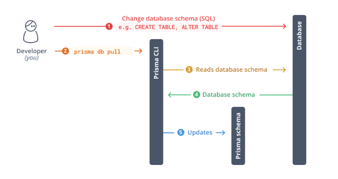

## [db pull](https://www.prisma.io/docs/getting-started/setup-prisma/add-to-existing-project/relational-databases/introspection-typescript-postgresql)

### 修改数据库后重新生成scheme.prisma



### 操作

```bash
Monk@LuMonkdeMacBook-Pro blog-portal % yarn prisma db pull
yarn run v1.22.22
$ /Users/Monk/Documents/reborn/blog-ws/blog-portal/node_modules/.bin/prisma db pull
Prisma schema loaded from prisma/schema.prisma
Environment variables loaded from .env
Datasource "db": MySQL database "blog" at "localhost:3306"

✔ Introspected 1 model and wrote it into prisma/schema.prisma in 62ms
      
*** WARNING ***

These objects have comments defined in the database, which is not yet fully supported. Read more: https://pris.ly/d/database-comments
  - Type: "field", name: "blog_user.id"
  - Type: "field", name: "blog_user.create_time"

Run prisma generate to generate Prisma Client.

✨  Done in 1.47s.
```

### 增加快捷脚本

* package.json

```json
{
  "name": "nuxt-app",
  "private": true,
  "type": "module",
  "scripts": {
    // ...
    "dbpull": "prisma db pull"
  },
  "dependencies": {
    // ...
  },
  // ...
}

```

* 测试

```bash
Monk@LuMonkdeMacBook-Pro blog-portal % yarn dbpull
yarn run v1.22.22
$ prisma db pull
Prisma schema loaded from prisma/schema.prisma
Environment variables loaded from .env
Datasource "db": MySQL database "blog" at "localhost:3306"

✔ Introspected 1 model and wrote it into prisma/schema.prisma in 43ms
      
*** WARNING ***

These objects have comments defined in the database, which is not yet fully supported. Read more: https://pris.ly/d/database-comments
  - Type: "field", name: "blog_user.id"
  - Type: "field", name: "blog_user.create_time"

Run prisma generate to generate Prisma Client.

✨  Done in 1.45s.
```