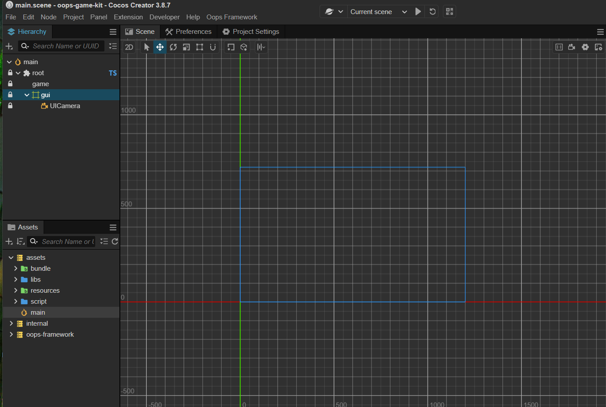

## [使用oops-game-kit开发模板初始化](https://gitee.com/dgflash/oops-game-kit)

### 下载模板

```bash
E:\monk\workspace\game-frame>git clone https://gitee.com/dgflash/oops-game-kit.git
Cloning into 'oops-game-kit'...
remote: Enumerating objects: 2320, done.
remote: Counting objects: 100% (129/129), done.
remote: Compressing objects: 100% (121/121), done.
remote: Total 2320 (delta 64), reused 0 (delta 0), pack-reused 2191 (from 1)                                            Receiving objects: 100% (2320/2320), 3.53 MiB | 1.78 MiB/s, done.

Resolving deltas: 100% (811/811), done.
```

### 修改模板名称


### 下载框架插件

#### Windows

* 执行 update-oops-plugin-framework.bat 下载框架源码插件
* 执行 update-oops-plugin-hot-update.bat 下载热更新插件（可选）
* 执行 update-oops-plugin-excel-to-json.bat 下载Excel转Json格式插件（可选）

### Cocos Dashboard打开项目


