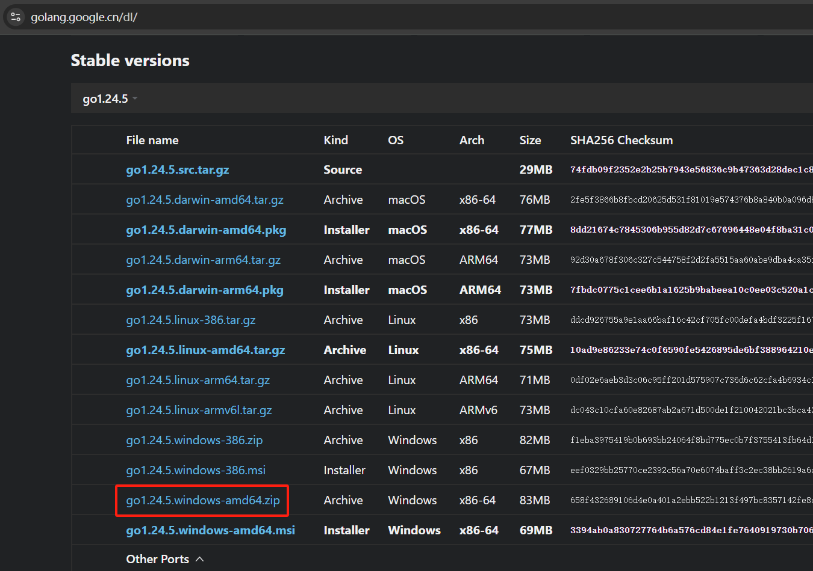
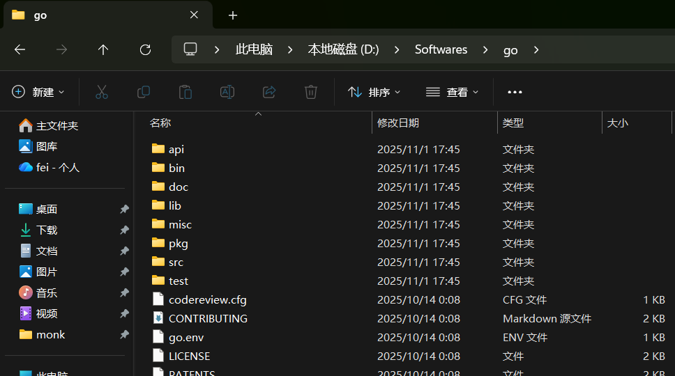
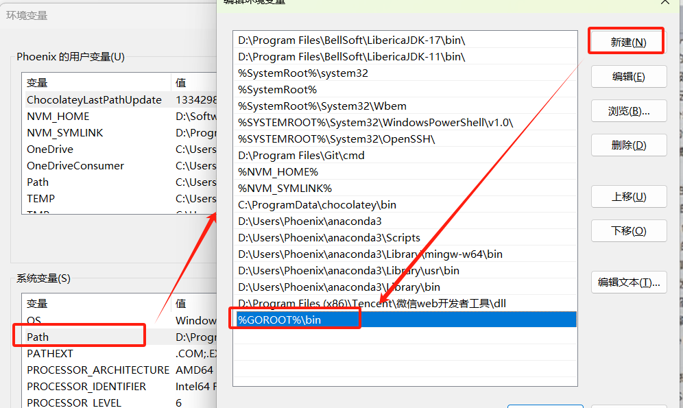

## Windows 安装 Golang 环境

### [下载 64 位包](https://golang.google.cn/dl/)



### 解压到目录(如 D:\Softwares\go),目录不要有中文



- bin 指令文件，包括 go 和 gofmt
- src 源码文件

### 配置环境变量

| Name   | Desc                                    |
| ------ | --------------------------------------- |
| GOROOT | 指定 SDK 的安裝路径，如 D:\Softwares\go |
| Path   | 添加 SDK 的 bin 路径                    |
| GOPATH | 工作目录                                |

- 增加 GOROOT 和 增加 GOPATH
  

- 增加 Path
  

- 设置 GO 模块镜像

```bash
# 设置GOPROXY的值
E:\> go env -w GOPROXY=https://goproxy.cn,direct

# 确认
E:\>go env GOPROXY
https://goproxy.cn,direct
```

### 验证 1

- go version

```bash
E:\>go version
go version go1.25.3 windows/amd64
```

### 验证 2

- E:\monk\workspace\game-frame

```go
package main

import (
	"fmt"
)

func main() {
	fmt.Println("hello world")
}
```

- go run main.go

```bash
E:\monk\workspace\game-frame>go run main.go
hello world
```
