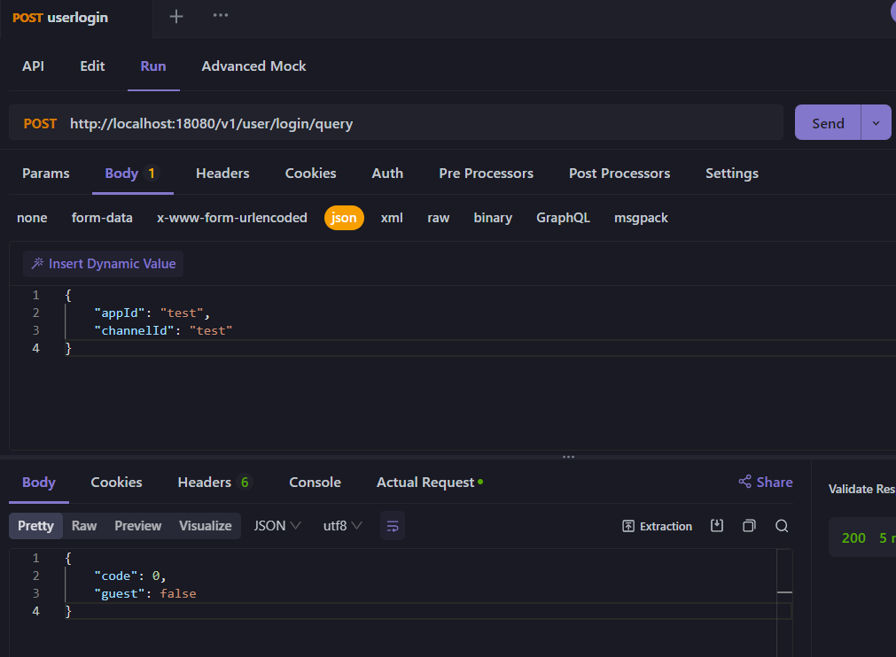

## 增加子路由

- game-frame-nano/internal/web/api/api.go

```go

package api

import (
	"log/slog"
	"net/http"

	"github.com/gorilla/mux"
	"github.com/lonng/nex"
	"github.com/spf13/viper"
)

const (
	CodeSuccess = 0
)

var (
	// 游客登陆
	enableGuest   = false
	guestChannels = []string{}

	enableDebug = false
)

func MakeLoginService() http.Handler {

	// 游客相关配置
	enableGuest = viper.GetBool("login.guest")
	guestChannels = viper.GetStringSlice("login.lists")
	slog.Info("guest login config",
		"enabled", enableGuest,
		"channels", guestChannels)

	router := mux.NewRouter()
	router.Handle("/v1/user/login/query", nex.Handler(queryHandler)).Methods("POST") //三方登录

	return router
}

// 查询是否使用游客登陆
type (
	queryRequest struct {
		AppId     string `json:"appId"`
		ChannelId string `json:"channelId"`
	}

	queryResponse struct {
		Code  int  `json:"code"`
		Guest bool `json:"guest"`
	}
)

var (
	acceptGuest = &queryResponse{Code: CodeSuccess, Guest: true}
	forbidGuest = &queryResponse{Code: CodeSuccess, Guest: false}
)

func queryHandler(query *queryRequest) (*queryResponse, error) {
	if query == nil {
		slog.Error("received nil query request")
		return forbidGuest, nil
	}

	slog.Info("query request",
		"appId", query.AppId,
		"channelId", query.ChannelId)

	if !enableGuest {
		return forbidGuest, nil
	}

	for _, channel := range guestChannels {
		if query.ChannelId == channel {
			return acceptGuest, nil
		}
	}

	return forbidGuest, nil
}

```

- game-frame-nano/internal/web/web.go

```go
// ...
func configServeMux() http.Handler {
	// ...
	nex.Before(logRequest)
    // 增加子路由
	mux.Handle("/v1/user/", api.MakeLoginService())
	//...
	return algoutil.AccessControl(algoutil.OptionControl(mux))
}
```

### 测试


