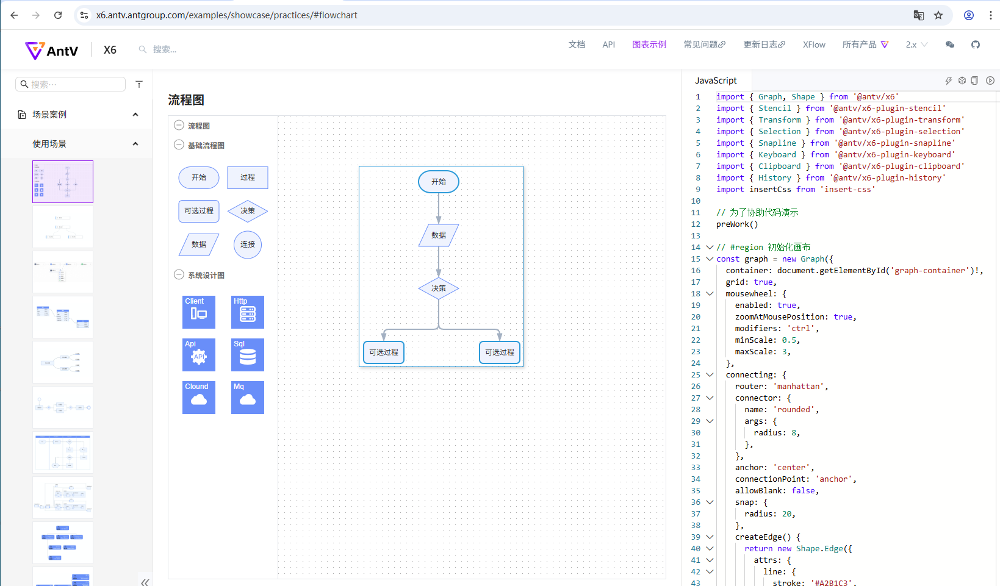
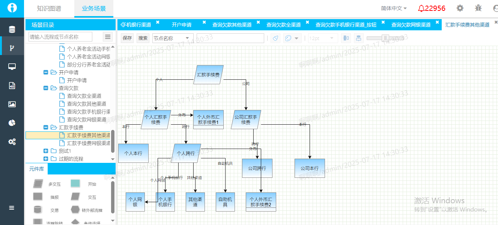
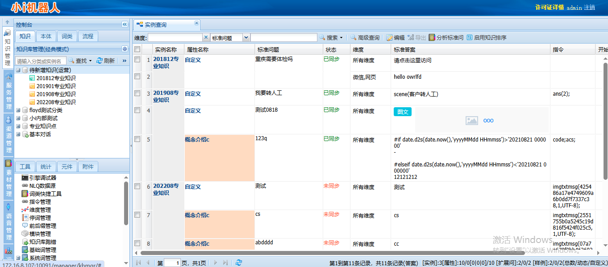
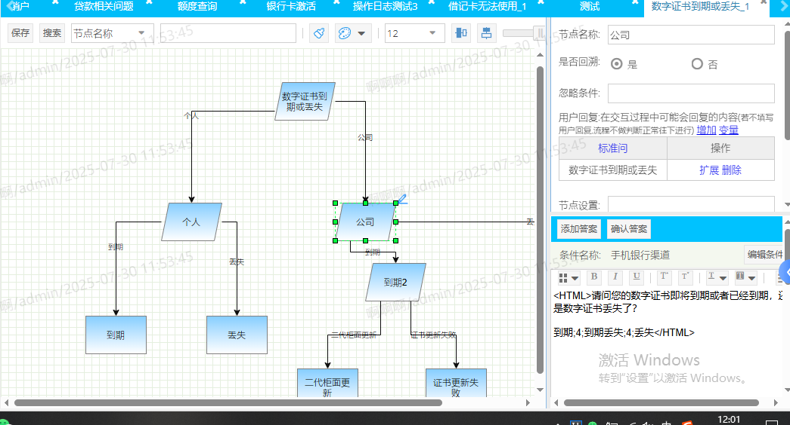
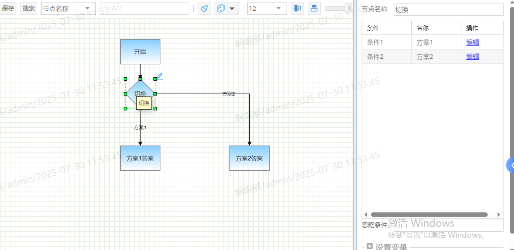
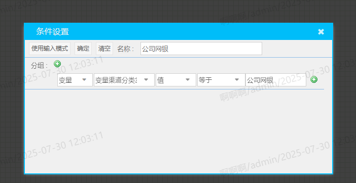

## IbotUI介绍

###


### [AntV6](https://x6.antv.antgroup.com/examples/showcase/practices/#flowchart)



### IbotUI



### 入口搭建



scene(信息收集场景, name=xxx, age=18, sex=1)

* 开始节点
    后置变量

* 交互节点



```
    前置变量
    type = 转人工

    后置变量
    业务办理 = 信用卡查询

    播报条件：sex = 1
    播报话术: ${name}先生你好，请问您要办理什么业务

    播报条件: sex = 0
    播报话术: ${name}女士你好，请问您要办理什么业务

    播报话术
        1. 站点查询
```

* 条件选择节点





```
    条件
```


* 播报节点（可做组合）
```
    类似交互节点，只不过不会停止等待
```

* 交易节点（Http接口调用）
```
    Url：localhost:8080
    type：POST|GET
    params：name = ''
    header: auth = ''
    body: ''
```

* 多交互节点
```
    变量
    account  账号   value
    nickname 昵称   value
    话术前置
        请输入您的
    话术后置
        一遍后续更新
```


* 跨流程跳转
```
    sceneID-nodeId
    后置变量：name = '' scope(session|flow)
```